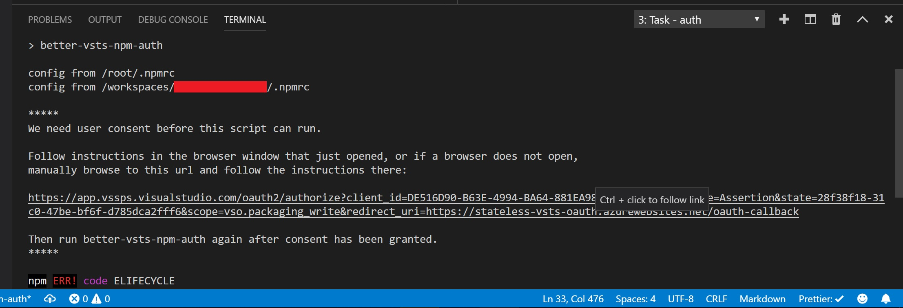
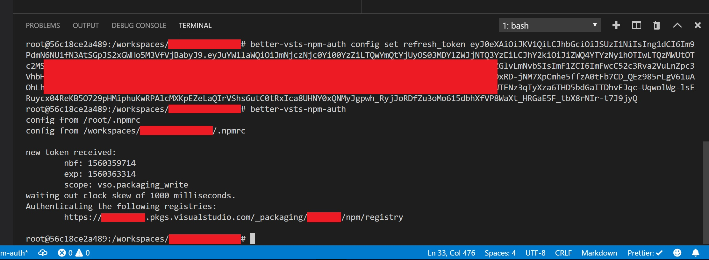

# better-vsts-npm-auth

Platform agnostic library and accompanying oauth service enabling developers to easily obtain and use tokens for authorizing NPM feeds in VSTS

[](https://circleci.com/gh/zumwald/better-vsts-npm-auth/tree/master)
[](https://github.com/prettier/prettier)

## Installation

While not necessary, _better-vsts-npm-auth_ was built to be used as a global module.
`npm i -g better-vsts-npm-auth`

## How to use it

Azure DevOps (formerly Visual Studio Team Services aka VSTS) [uses OAuth to authorize access to resources](https://docs.microsoft.com/en-us/azure/devops/integrate/get-started/authentication/oauth?view=azure-devops) - like your npm registries! Better-vsts-npm-auth is one half of a two-part solution: `better-vsts-npm-auth` is the piece of software which you install on your machine, and it handles all the OAuth magic for you. The second part of the equation is [`stateless-vsts-oauth`](https://github.com/zumwald/stateless-vsts-oauth) which is a very simple web endpoint which handles the OAuth flow described above. I designed both tools such that they never store your data - only _you_ decide where your data is stored. To see how that happens, and help you through your first use of `better-vsts-npm-auth` I'll walk you through the process:

1. Once installed, run `better-vsts-npm-auth`. It's going to print a warning like so, follow the instructions:
   
   > Note: take special notice of the text printed between the `*****` - it's <s>telling you that</s> _asking you politely to_ `Ctrl+Click` (`⌘+Click` on Mac) that link and sign in with the account you use to access your visualstudio.com project. Without that, `better-vsts-npm-auth` can't help you!
2. Once you click that link and sign in, visualstudio.com will redirect you to stateless-vsts-oauth.azurewebsites.net with a special code in the url. This is the "magic" which lets the authentication happen. The code (my code) running on the server at stateless-vsts-oauth.azurewebsites.net never sees the sensitive token in the url. All the page does is print it in clear, large print so that you can easily copy it back into your terminal.
   
3. By pasting that hunk of text back into your terminal where you typed `better-vsts-npm-auth` in step 1, you're invoking a command which is going to save that very sensitive piece of text onto your hard drive. It's important to know that's where this is stored (along with other important and potentially sensitive pieces of text in your `%USERPROFILE%/.npmrc` file - or `$HOME/.npmrc` for \*nix users). This text is a _refresh token_ - it allows `better-vsts-npm-auth` to continue acquiring _access tokens_ on your behalf. To learn more about what these tokens are for, check out the link at the top of the page which details OAuth and how VSTS uses it.
   
4. That's it! _Now_ you're ready, just type `better-vsts-npm-auth` and your credentials will be refreshed silently and you're be all set to install your npm packages.

> Note: The CLI comes with help docs, so if you can't find what you're looking for here, try `better-vsts-npm-auth --help`.

## Prior art

While incomplete - the lack of support for \*nix systems was perplexing - [vsts-npm-auth](https://www.npmjs.com/package/vsts-npm-auth) laid the foundation for this project in principle.

## Dependency on [stateless-vsts-oauth](https://github.com/zumwald/stateless-vsts-oauth)

VSTS's OAuth flow is documented [here](https://docs.microsoft.com/en-us/vsts/integrate/get-started/authentication/oauth). It requires an internet-facing service to complete the token exchanges. While you're welcome to use an existing service if you have one or build your own if you're so inclined, you can also use this service as-is. It's hosted at https://stateless-vsts-oauth.azurewebsites.net.

## Less common (albeit possible) - consuming `better-vsts-npm-auth` programmatically

Provided for direct integration with application-specific tooling. On my team, we use this in our [preinstall script](https://docs.npmjs.com/misc/scripts) for our project to harden our system against annoying token expirations needlessly breaking our development mojo.

Example:

```
const vstsAuth = require('better-vsts-npm-auth');
const input = require('input');

vstsAuth.run()
  .then(() => console.log('woohoo! No more annoying 401s'))
  .catch(e => {
      // we can catch AuthorizationError and prompt our users to
      // authorize the Stateless VSTS NPM OAuth application
      // (or your own application, if you specify an alternate
      // clientId in your config, which you're welcome to do)
      if (vstsAuth.isAuthorizationError(e)){
          // fail if we're running in a lab
          if (process.env['BUILD_BUILDID'] || process.env['RELEASE_RELEASEID']){
              return Promise.reject(e);
          }

          // wait for user input if we're running on a dev box
          // note - I like the input package, but feel free to get your user
          // input however you'd like
          return input.text('paste your refresh_token:').
            then(token => {
                vstsAuth.setRefreshToken(token);

                // not necessary, but nifty if you want to create a
                // seamless local dev startup experience by re-running
                return vstsAuth.run();
            })
      }});
```
